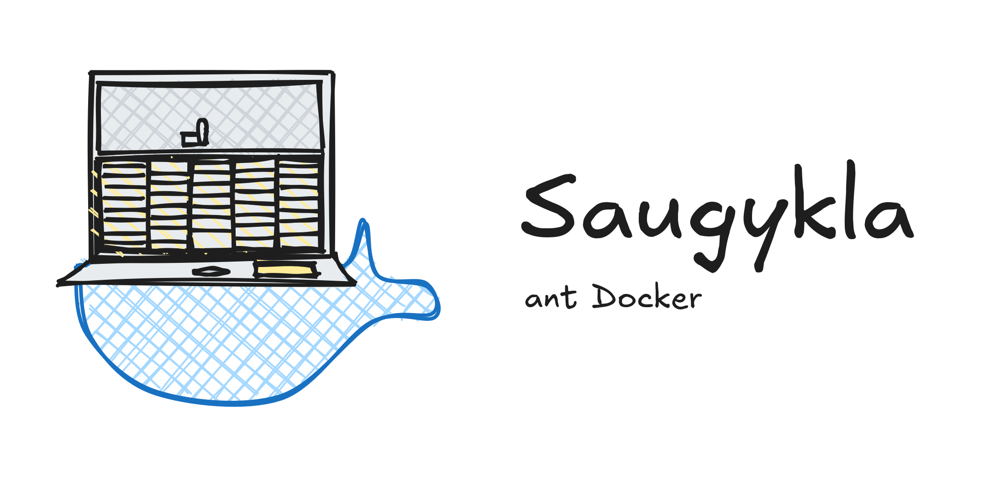

# saugyklaDocker



Docker setup for running a [Saugykla](https://atviriduomenys.readthedocs.io/latest/api/install.html) open data API instance.

---

## Requirements

- Docker
- Docker Compose

---

## Deploy

**1. Clone this repo**

**2. Create your env file:**

```bash
cp .env.example .env
```

**3. Open `.env` and set a strong database password:**

```env
POSTGRES_PASSWORD=your_strong_password_here
```

**4. Define your data models in `manifest.csv`** (see [Data model](#data-model) below)

**5. Build and start:**

```bash
docker compose up --build -d
```

**6. Check it is running:**

```bash
docker compose ps
docker compose logs -f spinta
```

The API will be available at `http://localhost:8000`. Intended to sit behind a reverse proxy in production.

On first boot the container automatically generates RSA signing keys, creates a default read-only API client, and runs database migrations.

---

## Environment variables

| Variable | Default | Required | Description |
|---|---|---|---|
| `POSTGRES_PASSWORD` | — | **Yes** | Database password |
| `POSTGRES_USER` | `spinta` | No | Database user |
| `POSTGRES_DB` | `spinta` | No | Database name |
| `GUNICORN_WORKERS` | `2` | No | Number of API worker processes. Set to 2× CPU cores in production. |
| `SPINTA_PORT` | `8000` | No | Host port the API binds to |
| `NOTICE` | — | No | HTML notice banner shown at the top of every page. Leave unset to show no banner. |

---

## Data model

The file `manifest.csv` defines the structure of your API — what models (tables) exist, what fields they have, their types, and who can access them. Saugykla reads this file on startup and creates the corresponding database tables. The included `manifest.csv` is an example; replace it with your own models before first run. Refer to the [Saugykla manifest documentation](https://atviriduomenys.readthedocs.io/latest/dsa/formatas.html) for the full format.

After changing `manifest.csv`, restart the API:

```bash
docker compose restart spinta
```

If you added a **new model**, also run bootstrap to create its database table:

```bash
docker compose exec spinta /opt/spinta/env/bin/spinta bootstrap
```

If you **renamed or removed a property** after data already exists, bootstrap will not alter the existing table — you must run the `ALTER TABLE` in PostgreSQL manually:

```bash
docker compose exec db psql -U spinta -d spinta
```

> **Important:** Model names appear in API URLs and must be ASCII only. Do not use Lithuanian characters (`ą č ę ė į š ų ū ž`) in the `model` column of `manifest.csv`.

---

## API clients and authentication

The API uses OAuth2 client credentials. Clients are YAML files stored in the `spinta_config` volume — they persist across restarts and rebuilds.

### Create a client

```bash
docker compose exec spinta \
  /opt/spinta/env/bin/spinta client add \
  -n <client_name> \
  -s <client_secret> \
  --add-secret \
  --scope "spinta_getall spinta_getone spinta_search spinta_changes"
```

The `--scope` flag sets the **maximum** scopes this client can ever receive. A token can only contain scopes the client was granted here.

Available scopes:

| Scope | Permission |
|---|---|
| `spinta_getall` | Read all records |
| `spinta_getone` | Read a single record by ID |
| `spinta_search` | Filter and search |
| `spinta_changes` | Read the changelog |
| `spinta_insert` | Create new records |
| `spinta_upsert` | Insert or update |
| `spinta_update` | Replace a record |
| `spinta_patch` | Partially update a record |
| `spinta_delete` | Delete records |
| `spinta_set_meta_fields` | Manually set `_id` and `_revision` |

**Example — read-only client:**

```bash
docker compose exec spinta \
  /opt/spinta/env/bin/spinta client add \
  -n readonly -s secrethere --add-secret \
  --scope "spinta_getall spinta_getone spinta_search spinta_changes"
```

**Example — full write client:**

```bash
docker compose exec spinta \
  /opt/spinta/env/bin/spinta client add \
  -n writer -s secrethere --add-secret \
  --scope "spinta_getall spinta_getone spinta_search spinta_changes spinta_insert spinta_upsert spinta_update spinta_patch spinta_delete spinta_set_meta_fields"
```

### Get an access token

```bash
curl -X POST http://localhost:8000/auth/token \
  -u "<client_name>:<client_secret>" \
  -H "Content-Type: application/x-www-form-urlencoded" \
  -d "grant_type=client_credentials&scope=spinta_getall spinta_getone"
```

The response contains an `access_token`. Tokens are valid for 10 days. Request only the scopes you need for that operation.

**Store the token in a variable for convenience:**

```bash
TOKEN=$(curl -s -X POST http://localhost:8000/auth/token \
  -u "writer:secrethere" \
  -H "Content-Type: application/x-www-form-urlencoded" \
  -d "grant_type=client_credentials&scope=spinta_insert spinta_getall spinta_set_meta_fields" \
  | python3 -c "import sys,json; print(json.load(sys.stdin)['access_token'])")
```

### Use the token

Pass it as a Bearer token on every request:

```bash
curl http://localhost:8000/datasets/... \
  -H "Authorization: Bearer $TOKEN"
```

---

## Reading data

No token is needed for models marked `access: open` in your manifest, as long as the default client exists.

```bash
# Browse all available models
curl http://localhost:8000/

# List all records in a model
curl http://localhost:8000/<dataset>/<Model>

# Get a single record by its UUID
curl http://localhost:8000/<dataset>/<Model>/<_id>

# Filter records
curl "http://localhost:8000/<dataset>/<Model>?field=gt(100)"
```

---

## Writing data

Insert a record:

```bash
curl -X POST http://localhost:8000/<dataset>/<Model> \
  -H "Authorization: Bearer $TOKEN" \
  -H "Content-Type: application/json" \
  -d '{"field": "value", ...}'
```

Update a record (replace):

```bash
curl -X PUT http://localhost:8000/<dataset>/<Model>/<_id> \
  -H "Authorization: Bearer $TOKEN" \
  -H "Content-Type: application/json" \
  -d '{"field": "new value", ...}'
```

Patch a record (partial update):

```bash
curl -X PATCH http://localhost:8000/<dataset>/<Model>/<_id> \
  -H "Authorization: Bearer $TOKEN" \
  -H "Content-Type: application/json" \
  -d '{"field": "new value"}'
```

Delete a record:

```bash
curl -X DELETE http://localhost:8000/<dataset>/<Model>/<_id> \
  -H "Authorization: Bearer $TOKEN"
```

---

## Volumes

All persistent data lives in named Docker volumes:

| Volume | What is stored |
|---|---|
| `postgres_data` | The PostgreSQL database |
| `spinta_config` | RSA keys and API client files |
| `spinta_var` | SQLite keymap and generated runtime config |
| `spinta_logs` | API access logs |

Volumes survive restarts and rebuilds. To start completely fresh:

```bash
docker compose down -v
```

---

## Logs

```bash
# Follow API logs
docker compose logs -f spinta

# Follow all services
docker compose logs -f

# Access log (inside container)
docker compose exec spinta tail -f /opt/spinta/logs/access.log
```

---

## Update

Pull the latest changes, rebuild the image, and restart. Volume data is preserved.

```bash
git pull
docker compose down
docker compose up --build -d
```

---

## Troubleshooting

**API returns 500 on every request**
Check logs with `docker compose logs spinta`. Usually a manifest parsing error or database connection issue on first boot.

**`bootstrap` does not create a column I added**
Bootstrap only creates tables and adds new columns it has never seen. If the table already exists with the old schema, run `ALTER TABLE` manually via `docker compose exec db psql -U spinta -d spinta`.

**Token request returns `invalid_client`**
The client name or secret is wrong, or the client was created while the container was in a bad state. Recreate it with `docker compose exec spinta /opt/spinta/env/bin/spinta client add`.

**`insufficient_scope` error when inserting data**
The token was issued without the required scope. Request a new token and include the needed scopes explicitly in the `scope` parameter.
